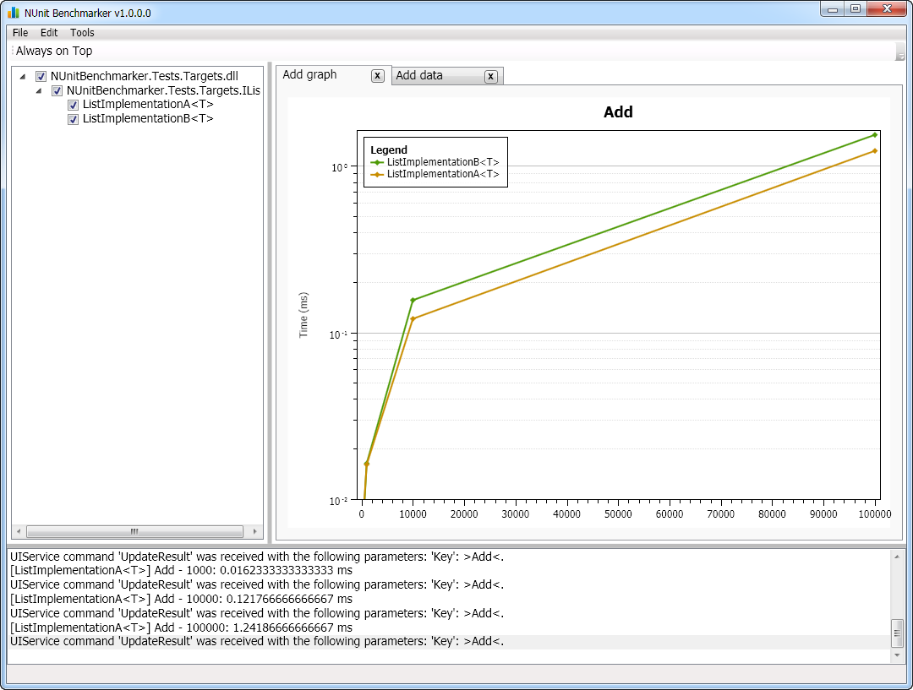

NUnitBenchmarker
==

A simple to use framework for setting up benchmarks and visualizing results in real time.

Write performance tests as you would normal unit tests with NUnit (with a little twist) and NUnitBenchmarker will take care of the rest.

 

## Features

Things NUnitBenchmarker can do for you *by writing simple unit test like code snipets*:

- Benchmarks your choosen interface's multiple implementations
- After the test method is written by you NUnutBenchmarker will
    - Look for the given interface's implementations 
        - by configuration
        - by convention (using the current folder's all assemblies
    - Optionally launches the GUI, where you can load and select more additional implementations
    - Runs the benchmarks you've defined as standard NUnit test methods 
    - Displays result diagrams and data tables in the GUI
    - Creates a PDF report with the diagrams and data tables.
- Can be used by any NUnit runner such as NUnit native runner or JetBrains ReSharper 
- Can run in GUI-less headless mode also
- Fully configurable by standard .NET configuration section

## Building The Solution

You will need Nuget installed on your computer.

The first time you build the solution, Nuget will fetch the required packages. (If it fails to do this you may have to right click on the solution and enable "Nuget Restore".) and then rebuild the solution again. This time it should work.

## Getting Started

To get an instant picture how can you utilize NUnitBenchmarker please read the [Getting Started](docs/GettingStarted.md) section 

## Roadmap

- Bindings and sample usage for other popular unit test frameworks
- Visual Studio integrated GUI

## License

This project is open source and released under the [MIT license.](LICENSE)

Please contribute to make it better ;)
