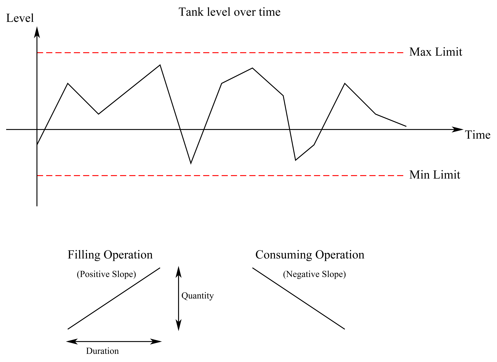

Stockpile Mangement
==

We have a buffer tank that has liquid put into and taken away from it at different points in time. The buffer tank has a min and max limit.

The picture below shows how the levels in the tank change over time:

 

## Aim:

We need a function which will tell us If and when we can add a new filling or consuming operation to the tank so that it does not go over (or under) the max (or min) limit.

The method signature should look something like this:

Result CheckOperation(DateTime startTime, TimeSpan duration, double quantity, TankLevels tankLevels).

The "Result" should have two properties:
- IsSucess :: bool
- StartTime :: DateTime (NOTE: the Result.StartTime may be equal or greater to the startTime supplied to the CheckOperation() method. Part of the challenge of this problem is finding the earliest time we can start the operation without breaching the limits.)

## Parameters:

- "StartTime": Is the time we would like to start adding the operation to the tank.

- "Duration": is the duration of the operation

- "Quantity": is how much liquid will be added to the tank during the whole duration of the operation. (If the value is negative then, liquid will be taken away from the tank.) 

- "TankLevels" is a collection of points which give you the level in the tank at different times.

## Features

Things NUnitBenchmarker can do for you *by writing simple unit test like code snipets*:

- Benchmarks your choosen interface's multiple implementations
- After the test method is written by you NUnutBenchmarker will
    - Look for the given interface's implementations 
        - by configuration
        - by convention (using the current folder's all assemblies
    - Optionally launches the GUI, where you can load and select more additional implementations
    - Runs the benchmarks you've defined as standard NUnit test methods 
    - Displays result diagrams and data tables in the GUI
    - Creates a PDF report with the diagrams and data tables.
- Can be used by any NUnit runner such as NUnit native runner or JetBrains ReSharper 
- Can run in GUI-less headless mode also
- Fully configurable by standard .NET configuration section

## [Getting Started](docs/GettingStarted.md)

To get an instant picture how can you utilize NUnitBenchmarker please read the [Getting Started](docs/GettingStarted.md) section 

## Roadmap

- Bindings and sample usage for other popular unit test frameworks
- Nuget package
- Visual Studio integrated GUI

## Troubleshooting

The actual test runner and the UI communicates via http. 
To listen on a port requires special permission. Admins automatically have this permission, however other users may or may not have. Admins can grant this permission for any other user. 

If you have not this permission the http listening WCF service can not start, and you got
"There was no endpoint listening at http://localhost:8091/NUnitBenchmarker/UIService that could accept the message. This is often caused by an incorrect address or SOAP action. See InnerException, if present, for more details."

Further infomation says: "WCF service cannot start because of lack of access rights:
HTTP could not register URL http://+:8091/NUnitBenchmarker/UIService/. Your process does not have access rights to this namespace (see http://go.microsoft.com/fwlink/?LinkId=70353 for details)."

Unfortunately the link in the exception text, http://go.microsoft.com/fwlink/?LinkId=70353, is broken. The correct link should be http://msdn.microsoft.com/en-us/library/ms733768.aspx which explains how to set the permissions:

**netsh http add urlacl url=http://+:8091/NUnitBenchmarker/UIService/ user=user**

## Support

You can ask for support on our mailing list: https://groups.google.com/forum/to_be_created

## Contribute

Everyone is encouraged to contribute, either by:

- Submitting pull requests
- Documentation
- Blogs and tutorials

## License

This project is open source and released under the [MIT license.](LICENSE)

