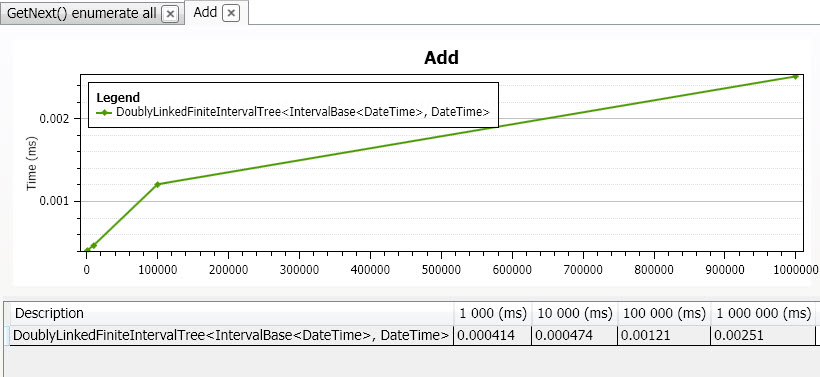
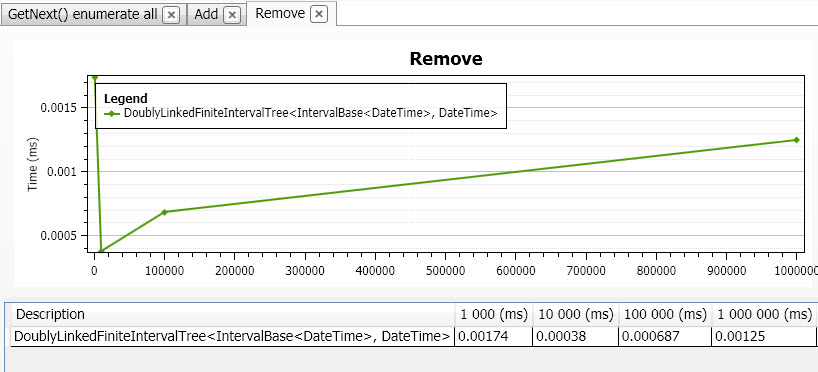
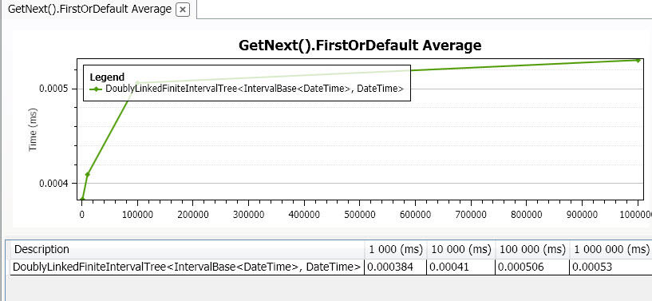
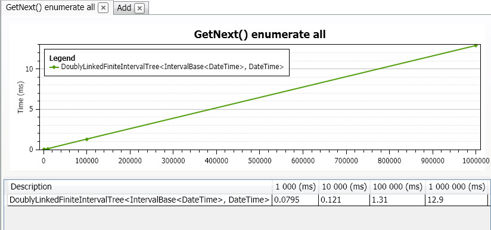

# C5 Intervals Benchmark

## Aim

This project serves as general benchmark repository for C5 Intervals project. To get mor details about C5 Intervals please refer to [Orcomp C5 Intervals project](https://github.com/Orcomp/C5Intervals "Orcomp C5 Intervals project") on GitHub

## Method

Currently the main focus is benchmarking common operations on IIntervalCollection such as:

- Construction
- Enumeration
- Find Gaps
- Find Overlaps By Interval
- Find Overlaps By Value
- Highest / Lowest
- Sorting related operations

For performance testing and visualizing results this project uses [NUninBenchmarker project](https://github.com/Orcomp/NUnitBenchmarker "NUninBenchmarker project"). Start with PerformanceTest classes, run the tests just as you would run any ordinary unit test.

## Dedicated benchmarks on DoublyLinkedFiniteIntervalTree (DLFIT)

DLFIT has two special methods what is although defined on the IIntervalCollection interface, DLFIT is the only implementor:

- IEnumerable<I> GetNext(I interval);
- IEnumerable<I> GetPrevious(I interval);

## Interpreting benchmark results 

For more details please refer to source filee: DlfitTestFactory.cs

The motivation for this dedicated benchmark was the concern about finding the first interval in the internal data stuctures may be slow. As the two target methods were pure read operations the standard Add and Remove operations also involved to see the trade-off and side-effects when introducing redundancy in the internal data structures.

** Add: **

The time we see is the average time of one Add operation while creating a 'size' sized tree.
The intervals are added in random permutated order (first generating in order count size, then permutate)
The result shown isdivided by size.

 

** Remove: **

The time we see is the average time of one Remove operation while removing all intervals from a 'size' sized tree. In the preparation the intervals added in order (this time does not count anyway in the benchmark) but when removing the intervals the order is a random permutation. The result shown is divided by size.

 

*** GetNetx().FindFirst: ***

GetNext and GetPrevious implementation is lazy. The time we see is the _average_ FindFirst in a 'size' sized tree. All the intervalls searched in the tree, so in a 'size' sized tree it is a 'size' count operation, The order should not matter, but despite of this the searches followed each other in random permutated order.
The result shown is divided by size.

 

*** GetNetx().Enumerate All: *** 

The time we see is the _average_ emumeration time in a 'size' sized tree. In all trees 100 picked (full) enumerations performed. The count of enumeration depends on what is the starting point within the tree,
that's why the 100 repeat with different queries. The result you see is divided by 100.

 

*** Conclusion: ***

_GetNetx().FindFirst:_ As it was expected it is something O(log2(size)).(Finding the entry starting interval done by navigating in a binary tree. However it seems to be very fast in the expected size range, and because of log characteristics it will not increase unexpectedly. It will increase less and less percent with bigger sizes.

_GetNetx(). Enumerate All:_ This was also expected: Linear with size, because the returning element count is linear with size. This justifies the hypothesis: We should not worry about the the starting internal find overhead when using GetNext (binary traverse vs hashtable lookup). The find overhead does not even measurable in this case.

